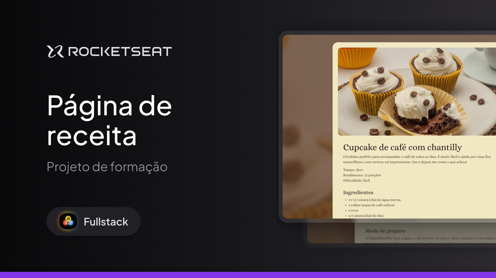

<h1 align="center"> Página de Receita </h1>

Esse é um dos projetos desenvolvidos em aula na formação Full-Stack, conteúdo de especialização da Rocketseat.  

  <a href="#-tecnologias">Tecnologias</a>&nbsp;&nbsp;&nbsp;|&nbsp;&nbsp;&nbsp;
  <a href="#-projeto">Projeto</a>

 

  

## 🚀 Tecnologias

Esse projeto foi desenvolvido com as seguintes tecnologias:

- HTML e CSS
- Figma

## 💻 Projeto

Uma página simples de receita.

Inspirado no projeto original da <a href="https://app.rocketseat.com.br/journey/full-stack/contents">Rocketseat</a>, desenvolvido por <a href="https://www.linkedin.com/in/larissakmnakamura/">Larissa Nakamura</a>.